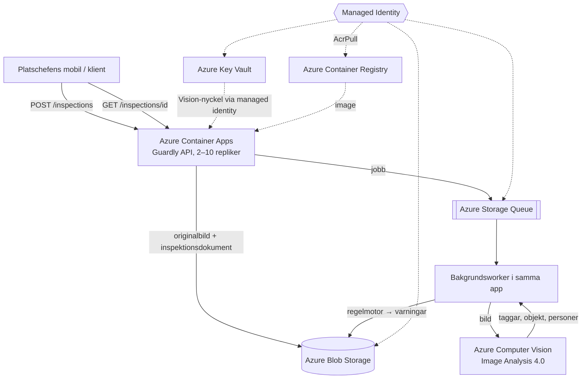

# Teknisk leveransrapport

**Uppdrag:** Guardly AB — Säkerhetsinspektion av byggplatsfoton som tjänst
**Konsultteam:** Can Öz, Jakob El Saidi
**Datum:** 2 oktober 2026
**Version:** 1.0

---

## Sammanfattning

Vi har levererat en molnbaserad tjänst som gör den första granskningen av byggplatsfoton
automatiskt. Platschefen laddar upp ett foto och får några sekunder senare tillbaka vad
bilden innehåller och konkreta varningar — till exempel att en person saknar hjälm eller
väst, eller att det finns ställningar i bild som kräver fallskydd. Guardlys tre ingenjörer
behöver inte längre gå igenom varje bild för hand i ett kalkylark, utan kan lägga tiden på
de bilder där systemet flaggat något. Tjänsten körs i Microsoft Azure, växer automatiskt
när många laddar upp samtidigt och kostar cirka 509 kronor i månaden vid lansering.

---

## Vad som levereras

### Inkluderat i leveransen

| Komponent | Teknisk lösning | Status |
|---|---|---|
| REST API | .NET 8 Minimal API, 7 endpoints (krav: 4) | ✅ Levererat |
| Containerisering | Docker, multi-stage build, körs som icke-root | ✅ Levererat |
| Driftsättning | Azure Container Apps, 2–10 repliker | ✅ Levererat |
| Bildarkiv | Azure Container Registry (Basic) | ✅ Levererat |
| Fillagring | Azure Blob Storage — originalbild + ett JSON-dokument per inspektion | ✅ Levererat |
| Kö för bildanalys | Azure Storage Queue + bakgrundsworker | ✅ Levererat |
| AI-analys | Azure Computer Vision, Image Analysis 4.0 | ✅ Levererat |
| Hemlighetshantering | Azure Key Vault, läses med managed identity | ✅ Levererat |
| Övervakning | Application Insights + Log Analytics | ✅ Levererat |
| Infrastruktur som kod | Bicep, separata parameterfiler för dev och prod | ✅ Levererat |
| Automatiserad driftsättning | Azure DevOps YAML-pipeline: bygg → test → ACR → Container Apps | ✅ Levererat |
| API-dokumentation | Swagger UI (`/swagger`) | ✅ Levererat |
| Larm | Två larm definierade i Bicep (serverfel, kölängd) | ⚠️ Definierat, ej aktivt — kursprenumerationens policy nekar larmresurser |

**API:ets endpoints:**

| Anrop | Vad platschefen får |
|---|---|
| `POST /inspections` | Laddar upp ett foto, får tillbaka ett inspektions-ID direkt |
| `GET /inspections/{id}` | Analysresultat: taggar, konfidenspoäng, varningar |
| `GET /inspections` | Alla inspektioner, filtrerbart per arbetsplats och status |
| `GET /inspections/{id}/image` | Originalbilden |
| `GET /stats` | Sammanställning per arbetsplats — underlaget till veckorapporten |
| `GET /health`, `GET /health/ready` | Driftövervakning |

Varje varning har en allvarlighetsgrad (`High`, `Medium`, `Info`) och en konfidenspoäng,
så att de allvarligaste avvikelserna kan hamna överst i en arbetslista. Tröskelvärdena
ligger i konfigurationen och kan justeras utan ny kod.

### Utanför leveransens scope

Följande punkter identifierades under uppdraget men ingår inte i denna leverans. De
rekommenderas som nästa steg.

| Punkt | Motivering |
|---|---|
| Autentisering för slutanvändare | API:et är i dag öppet. Kräver Entra ID eller API-nyckel per kund och definierade roller — måste göras före kundlansering |
| Egen tränad bildmodell (Custom Vision) | Den generella modellen känner inte igen hjälm och väst tillförlitligt (se Kvarvarande risker). Kräver märkt träningsdata från Guardlys befintliga bilder |
| Aktiva larm | Larmen finns i Bicep men kursprenumerationens policy nekar larmresurser. Slås på med en parameter i Guardlys egen prenumeration |
| Gallring av bilder | Ingen automatisk radering eller flytt till billigare lagring finns. Gallringstiden är ett GDPR-beslut som Guardly måste fatta först |
| Kvot per arbetsplats | Ingen begränsning av antal bilder per kund. Behövs för att skydda affärsmodellen "obegränsat antal bilder" |
| Webbgränssnitt för platschefen | API:et svarar med JSON. En enkel webbvy är nästa steg för användarvänlighet |
| Disaster recovery | Lagringen är lokalt redundant (LRS) — kurspolicyn tillåter inte zonredundans. En återställningsplan bör definieras före produktion |

---

## Arkitektur

### Systemdiagram

**Flödet:** Uppladdningen sparar bilden och lägger ett jobb på kön, och svarar efter
ungefär två tiondels sekund. Analysen sker i bakgrunden: workern skickar bilden till
Computer Vision, Guardlys regelmotor tolkar svaret till varningar, och resultatet sparas
som ett JSON-dokument i Blob Storage. Platschefen kan ta tjugo bilder i rad utan att
vänta mellan varje.

### Motiverade arkitekturval

**Varför Azure Container Apps och inte AKS?**
Guardly har tre ingenjörer och ingen driftorganisation. Container Apps sköter servrar,
uppdateringar, certifikat och skalning åt oss, och vi betalar bara för de resurser som
faktiskt används. AKS skulle ge mer kontroll, men kräver att någon sätter upp och
underhåller ingress, certifikathantering och nodpooler — arbete som inte gör produkten
bättre. Applikationen är en enda container som tar emot HTTP och skalar på last, vilket
är precis det Container Apps är byggt för. AKS blir aktuellt först om Guardly växer till
många samverkande tjänster eller behöver GPU för egen modellträning.

**Varför Bicep och inte manuell konfiguration?**
All infrastruktur är beskriven i `infra/main.bicep` och versionshanteras i git, så varje
ändring är spårbar och granskningsbar. Mallen är idempotent: den kan köras om hur många
gånger som helst och ger samma resultat, vilket gör att en ny miljö för en stor kund är
ett kommando, inte ett projekt. Med `what-if` ser vi exakt vad som ändras innan
produktionen rörs — under leveransen fångade det två policyfel innan de nådde drift.

**Varför Azure Blob Storage för fillagring?**
Bilder är stora binärfiler som läses sällan efter analys — det är vad Blob Storage är
gjort för, till cirka 0,19 kr per GB och månad. Varje inspektion sparas som ett eget
JSON-dokument under arbetsplatsens prefix, så att "alla inspektioner för arbetsplats X"
blir ett enda billigt anrop utan databas. Åtkomsten sker uteslutande med managed identity;
nyckelbaserad åtkomst är avstängd på kontot.

---

## Säkerhetsarkitektur

### Identitet och åtkomst

| Resurs | Åtkomstkontroll |
|---|---|
| Azure Container Apps | User-assigned managed identity — ingen hårdkodad nyckel |
| Azure Blob Storage + Queue | RBAC via managed identity (Storage Blob/Queue Data Contributor). Nyckelåtkomst avstängd (`allowSharedKeyAccess: false`) |
| Azure Container Registry | RBAC via managed identity (AcrPull). Admin-användare avstängd |
| Azure Key Vault | Åtkomstpolicy: appens identitet får bara läsa hemligheter |
| Azure Computer Vision | Nyckel från Key Vault, hämtad med managed identity (se nedan) |
| Pipeline-credentials | Azure DevOps service connection med workload identity federation — inget lösenord som kan läcka |

### Hemlighetshantering

Inga credentials lagras i källkod, i Bicep-mallarna, i pipelinen eller i git-historiken.
Storage, kö och registry nås direkt med managed identity, utan någon hemlighet alls.

Computer Vision är undantaget. Kursens Vision-resurs ligger i en annan Entra-tenant än
vår prenumeration, och en managed identity kan bara få åtkomst inom sin egen tenant. Vi
lade därför nyckeln i Azure Key Vault. Container App:en refererar till hemligheten och
hämtar den med sin managed identity när den startar — värdet finns aldrig i kod eller
konfigurationsfiler. Ligger Vision-resursen i samma tenant, som den skulle göra i
Guardlys egen prenumeration, används managed identity direkt och nyckeln behövs inte.

### Kvarvarande risker

| Risk | Sannolikhet | Åtgärd |
|---|---|---|
| API:et saknar autentisering för slutanvändare | Hög | Entra ID Easy Auth eller API-nyckel per kund före lansering |
| Bildanalysen missar hjälm och väst och ger falska varningar | Hög | Stickprovsgranskning av ingenjörerna; träna en egen modell på Guardlys bilder |
| Byggplatsfoton är personuppgifter (GDPR) | Hög | Personuppgiftsbiträdesavtal med kunderna och beslutad gallringstid |
| "Obegränsat antal bilder" kan göra en kund olönsam | Medel | Rimlighetsgräns i avtalet, t.ex. 2 000 bilder per arbetsplats och månad |
| Inga aktiva larm — fel upptäcks först när någon tittar | Medel | Slå på larmen i Guardlys egen prenumeration (en parameter) |
| Ingen rate limiting på `POST /inspections` | Medel | Throttling per kund eller Azure API Management |
| Vision-nyckeln kan läcka utanför systemet | Låg | Rotera nyckeln; den byts på ett ställe i Key Vault |
| Beroende av Microsoft som leverantör | Låg | Bildanalysen ligger bakom ett eget gränssnitt i koden — byte av leverantör är en avgränsad ändring |

**Om bildanalysens träffsäkerhet.** Vi testade med riktiga byggplatsfoton. Computer
Vision hittade personerna korrekt, men känner inte igen en bygghjälm som en hjälm — den
beskriver scenen (byggnad, himmel, möbler), inte utrustningen på personerna. Resultatet
blev en varning om saknad hjälm även för en arbetare som bar en. Systemet ska därför ses
som ett sorteringsstöd, inte ett beslut, tills en egen modell är tränad.

---

## Kostnadskalkyl

### Månadskostnad vid lansering

| Resurs | SKU | Uppskattad kostnad/mån |
|---|---|---:|
| Container Apps Environment | Consumption | 0 kr |
| Container App | Consumption, 2 repliker à 0,5 vCPU / 1 GiB | 244 kr |
| Azure Container Registry | Basic | 52 kr |
| Azure Blob Storage + Queue | Standard LRS, Hot | 18 kr |
| Azure Computer Vision | S1, 18 000 transaktioner | 189 kr |
| Azure Key Vault | Standard | 0 kr |
| Log Analytics + Application Insights | Pay-as-you-go, under gratisgränsen | 0 kr |
| Utgående datatrafik | — | 5 kr |
| Azure DevOps | Basic (≤ 5 användare), 1 gratis parallellt jobb | Gratis |
| **Totalt** | | **509 kr/mån** |

Beräknat med 20 kunder (100 arbetsplatser) och 200 bilder per dag, alltså 6 000 analyser
per månad. Azure debiterar Computer Vision per begärd funktion, inte per bild: vi begär
tre (taggar, objekt, personer), vilket ger 18 000 transaktioner. Källa: Azure Pricing
Calculator, region Sweden Central, september 2026, 1 USD = 10,50 kr.

Intäkten vid lansering är 100 × 1 499 = 149 900 kr/mån, så infrastrukturen motsvarar
**0,34 % av intäkten**. Om kundbasen tredubblas blir kostnaden **922 kr/mån** — inte tre
gånger så mycket, eftersom applikationens grundkostnad är fast. Kostnaden per arbetsplats
sjunker då från 5,09 kr till 3,07 kr. Detaljerad uträkning finns i `ARCHITECTURE.md`.

### Skalningspunkt

Styrelsens fråga — *vad händer om en kund laddar upp 500 bilder på fem minuter?* —
besvaras av kön. Uppladdningarna nekas aldrig, eftersom de bara sparar bilden och lägger
ett jobb på kön. Container Apps startar fler repliker när kön växer, och samtliga 500
resultat är klara ungefär två och en halv minut efter sista uppladdningen. Det kostar
cirka 16 kronor.

Flaskhalsen är Computer Vision, inte vår applikation. S1-nivån tillåter 10 transaktioner
per sekund, och med tre transaktioner per bild blir taket cirka 3,3 bilder per sekund —
ungefär 12 000 bilder i timmen. Guardly gör i dag 200 om dagen. Vid en fyrdubbling av
trafiken märks ingen skillnad i vardagen; först om toppar närmar sig taket behöver
Guardly antingen begära höjd gräns hos Microsoft (kostnadsfritt) eller minska antalet
funktioner per bild, vilket också sänker kostnaden.

---

## Rekommendationer inför produktionssättning

1. **Autentisering för slutanvändare** — Entra ID Easy Auth eller API-nyckel per kund
   innan offentlig lansering. Den enskilt viktigaste åtgärden.
2. **Rimlighetsgräns i kundavtalet** — förslagsvis 2 000 bilder per arbetsplats och
   månad med rörlig debitering därutöver. Vid 2 000 bilder är marginalen fortfarande 96 %.
3. **Aktivera larmen** — i Guardlys egen prenumeration slås de på med parametern
   `alertEmail`: larm vid fler än 5 serverfel på 5 minuter och vid fler än 200 bilder i kön.
4. **Gallringstid och personuppgiftsbiträdesavtal** — bestäm hur länge bilderna sparas
   och lägg in en automatisk raderingsregel i Blob Storage.
5. **Kostnadslarm** — budget-alert i Azure Cost Management vid 80 % av månadsbudgeten.
6. **Stickprovsgranskning** — låt ingenjörerna granska bilder som systemet godkänt de
   första månaderna, och justera känsligheten utifrån verkliga data.
7. **Träna en egen modell** — Guardlys manuellt granskade bilder i kalkylarket är exakt
   det träningsmaterial som behövs för att känna igen hjälm och väst på svenska
   byggarbetsplatser. Kalkylarket är inte en flaskhals, det är bolagets värdefullaste
   tillgång.

---

## Överlämning

| Leverabel | Plats |
|---|---|
| Källkod | https://github.com/Knightdotcom/guardly-scenario-b |
| Bicep-mallar | `/infra/` i repot |
| Pipeline-definition | `azure-pipelines.yml` i repots rot |
| API-dokumentation | https://ca-guardly-api-prod.politeocean-d6e94601.swedencentral.azurecontainerapps.io/swagger |
| Teknisk dokumentation | `ARCHITECTURE.md` i repots rot |
| Återställningsrutin | `docs/ROLLBACK.md` |
| Denna rapport | `RAPPORT.md` i repots rot |

Rapporten är upprättad av konsultteamet som ett avslutande leveransdokument. Frågor
hänvisas till teamet via Azure DevOps.
